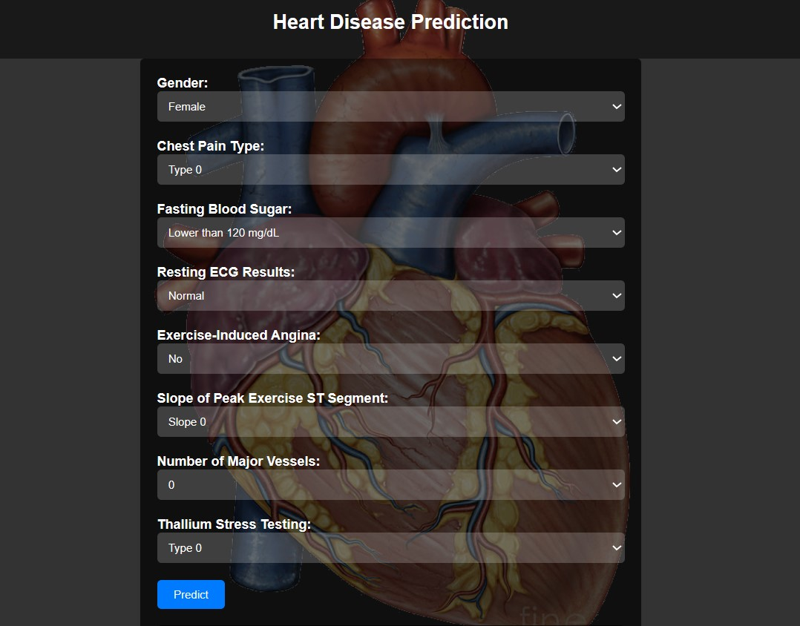
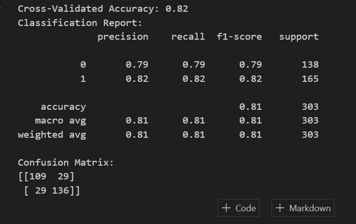
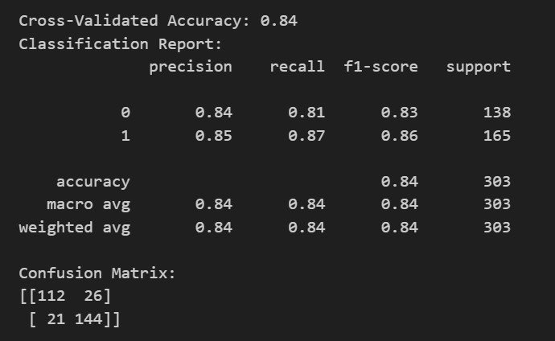

# Heart Disease Prediction Web Application

## Overview

In this machine learning project, I have collected the dataset from Kaggle ([Heart Disease UCI Dataset](https://www.kaggle.com/ronitf/heart-disease-uci)) and I will be using Machine Learning to predict whether any person is suffering from heart disease.

## Web Application Interface

The web application provides a user-friendly interface where users can input patient details through various input fields. After filling out the details, users can click the "Predict" button to trigger the prediction process. The application then displays a prediction indicating whether the patient is likely to have heart disease or not.

## Machine Learning Model

The machine learning model used in this project is a K-Nearest Neighbors (KNN) classifier. The model was trained on a Kaggle dataset containing various features related to heart health. The accuracy of the model was evaluated using cross-validation and achieved an accuracy of approximately 85%.

## Project Structure

The project is organized as follows:

- `index.html`: The HTML file containing the user interface for the web application.
- `app.py`: The Flask web application script responsible for serving the HTML, handling form submissions, and making predictions using the trained model.
- `model.pkl`: The serialized KNN model saved as a binary file.
- `WebApp.jpg`: A screenshot of the web application's user interface.

## Usage

1. Install the required Python packages using `pip install -r requirements.txt`.
2. Run the Flask application using `python app.py`.
3. Access the web application by navigating to `http://localhost:5000` in your web browser.
4. Fill out the patient details in the input fields.
5. Click the "Predict" button to receive the heart disease prediction.

## Screenshots

### Model Evaluation

*Figure 1: Random Forest Accuracy*

This image shows the accuracy achieved by the Random Forest algorithm during the model evaluation process. It demonstrates the model's performance on the heart disease prediction task.

*Figure 2: K-Nearest Neighbors (KNN) Accuracy*

This image presents the accuracy achieved by the K-Nearest Neighbors (KNN) algorithm, which was chosen as the final model for the web application. It showcases the model's effectiveness in predicting heart disease.

## Acknowledgments

- Kaggle (Dataset source)
- Scikit-learn (Machine learning library)
- Flask (Web framework)

